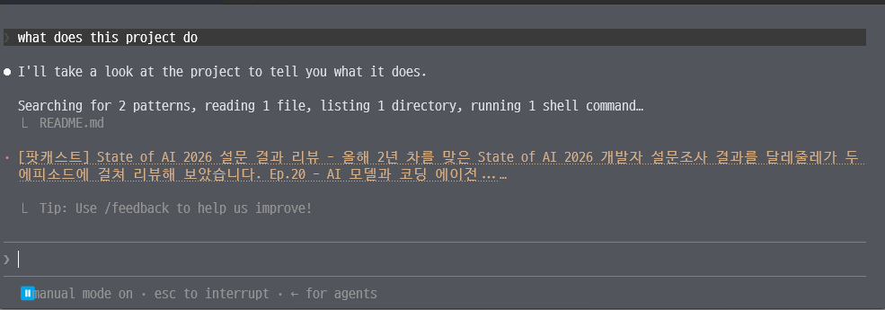

# Claude GeekNews Spinner

Claude Code가 응답을 생성하는 동안 GeekNews 최신 글을 spinner에 표시합니다.

`SessionStart`와 `UserPromptSubmit` 훅을 등록하며, 세션 시작과 매 요청마다 최신 GeekNews로 `~/.claude/settings.json` 파일의 `spinnerVerbs.verbs` 항목을 갱신합니다.



## 설치

Claude Code에서 아래 명령을 순서대로 실행합니다.

```text
/plugin marketplace add SazFirst/claude-geeknews-spinner
/plugin install claude-geeknews-spinner@geeknews-spinner
```

설치한 뒤 Claude Code를 새로 시작하면 바로 적용됩니다.

## 업데이트

새 버전은 다음 명령으로 적용합니다.

```text
/plugin update claude-geeknews-spinner@geeknews-spinner
```

업데이트한 뒤 Claude Code를 새로 시작합니다.

## 제거

```text
/plugin uninstall claude-geeknews-spinner@geeknews-spinner
```

플러그인을 제거하면 자동 갱신이 중지됩니다. 마지막으로 표시된 GeekNews 문구는 남아 있습니다.

기본 spinner 문구로 되돌리려면 `~/.claude/settings.json`에서 최상위 `spinnerVerbs` 항목 전체를 삭제한 뒤 Claude Code를 새로 시작해야 합니다.
